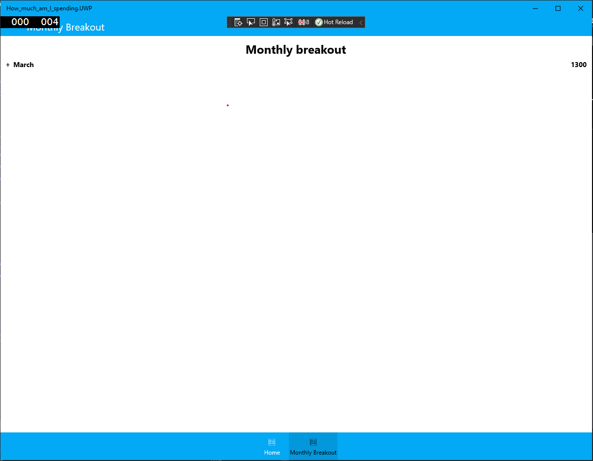

# How Much Am I Spending
## _Control your expenses_

How Much Am I Spending is a mobile application that will help you track your spent money from month to month. 

## Features

- Add new expenses with its reason to have some history 
- Track your total current month expenses  
- Track the history of previous months expenses

## Tech

How Much Am I Spending is built on top of Xamarin Forms and a number of related technologies:

- [Xamarin] - Free. Cross-platform. Open source 
- [Entity-framework] - a modern object-database mapper for .NET
- [.Net Framework] 
- [c#]

## Running Solution

To run the solution, you can simply run it on Visual studio.
> If you are missing some componnents in Visual studio to run the project, you will be prompted to install them

The Solution have 3 target platforms: 
- Android
- IOs
- UWP (the tested and most supported platform)

## Architecture

How Much Am I Spending solution have serveral project projects:
- How_much_am_I_spending: contains the shared code between platform (mainly views)
- How_much_am_I_spending.Android: project Targetting  Android platform
- How_much_am_I_spending.iOS: Project Targetting IOS platform 
- How_much_am_I_spending.UWP: Project Targetting UWP platform
- Model: contains the data models used by different application
- RecordsDB: This project is responsible of communicating to Database and it's considered the persistance layer
- TestDB: A seperate console application used to test the RecordsDB project.

## Development

Want to contribute? Great!
Here's an explication for all views:

### Views
The Application is composed of two views: 
**HomeView:**

It's composed 3 main parts: 
1- the Total current month spent: it changes each month and shows the total spent money for this month only, it gets updated when a new record is added for the current month
2- The Form to add new expenses: It's composed of two text inputs. 
> The form can only be submitted if the money is a float number

3- The Current month breakdown: it's a list that shows all the expenses of this month only and gets updated when a new record is added for the current month 
> The list view shows only the current month records due to the use of Linq's Where statement.

**AboutView:**

It's composed of 1  parts: 
1- A list view that shows the total expenses of all the previous months + the current month. It gets updated automatically when a new record is added to the current month.
> the records are grouped by month due to the use of the Linq's GroupBy statement
> The monthly breakdown is ordered according to the year months as well.
 

[//]: # (refrences)

   [Xamarin]: <https://dotnet.microsoft.com/en-us/apps/xamarin>
   [Entity-framework]: <https://docs.microsoft.com/en-us/ef/>
   [.Net Framework]: <https://docs.microsoft.com/en-us/dotnet>
   [c#]: <https://docs.microsoft.com/en-us/dotnet/csharp/>
 
